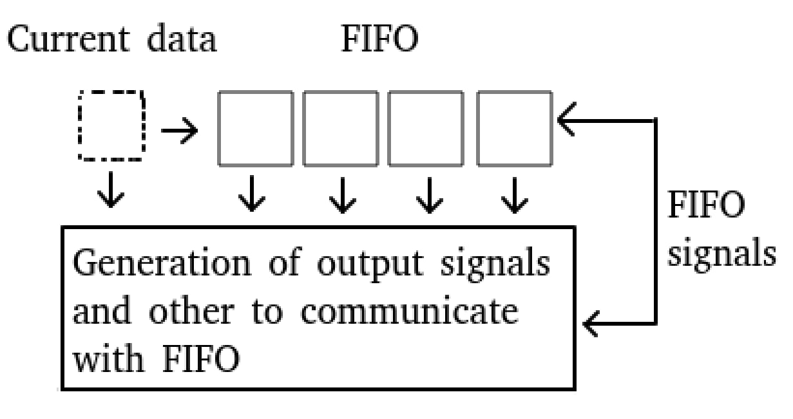

# STREAM UPSIZE

Surface general scheme to understand of work principle.

## LISTING OF CODE COMMENTS
### General module features
  1. For avoiding latency current data participate in output logic as well as
     data of FIFO. Thus DEPTH of FIFO is T_DATA_RATIO-1.
     Meanwhile WIDTH is T_DATA_WIDTH+1 because store data and valid (further m_keep signals) signals.
  2. m_keep_o during to pop is unary code with also high bit in logic one. It's occur because get into FIFO already correct data (that was with high s_valid), and high bit of m_keep is logic one since current data (that else not stored on fifo) also participate in output logic.
     There are 2 situations:
     - upsized packet transmit when is used full of T_DATA_RATIO cells (this always fifo cells + current data).
     - Suppose fifo not full but came last packet. It always will be current packet, located in high bit of m_data_o and validated of m_keep_o high bit.
    Thus "m_keep_o during to pop is unary code with also high bit in logic one" explained.
   3. Module can't be configured with T_DATA_RATIO (possible size of output packet) equal 1. 

### FIFO
  1. Сontinuously parallel access to all cells of fifo.
  2. The reading pointer is missing because of the 1-st point.
  3. POINTER_WIDTH+1 dim to detect FULL state. This possible because DEPTH is pow of 2. 

## HOW TO RUN
Module runs with simulation.
__Vivado EDA__.
### Just write "make"
There is GUI flag. So you can 
Test has following unchanched parameters:
1. T_DATA_WIDTH = 4
2. T_DATA_RATIO = 2

Also input data are deterministic. But checking implemented through assert property for all output signals. So you can edit test values to your taste and check working with the help given waveform. 

Simulation report: __.tmp/sim_out__